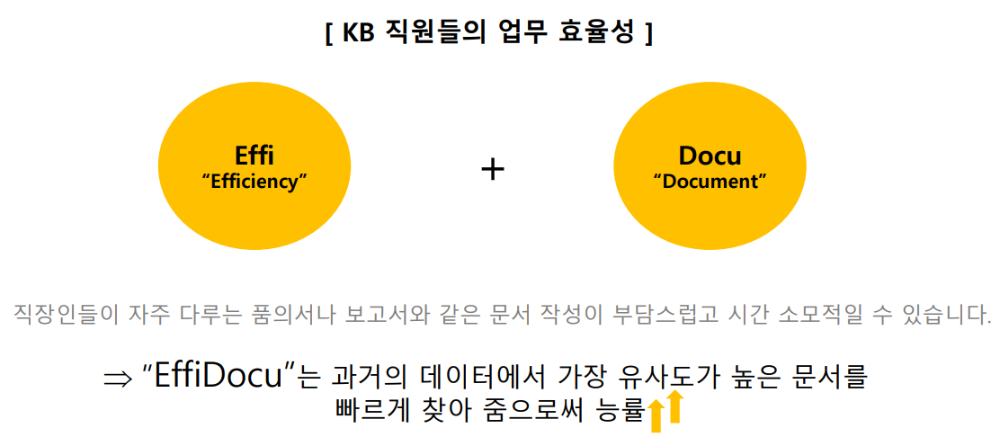
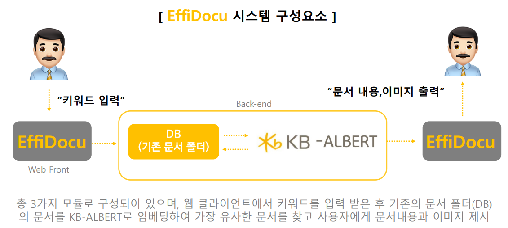
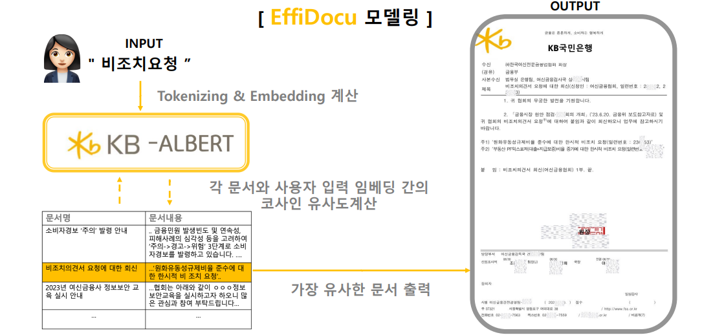
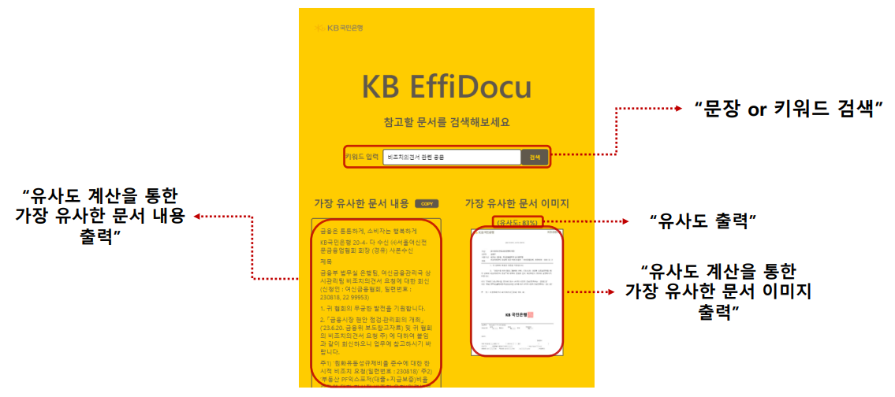

<h1 align="middle">KB EffiDocu</h1>

 

## 서비스 소개 ✏

<h4>기존에 작성되어 있는 행내 문서(품의서, 시행문 등)를 검색하여 가장 적합한 문서를 찾는 AI 서비스입니다.</h4>

 

## 팀원 👩‍👦‍👦

| 김하늘 | 배성찬 | 이승진 |
| :----: | :----: | :----: |

 

## 기술 스택 🛠️

 

## 시스템 구성 요소 🎨

 

## 모델링 💻

 

## 기능 소개 🧰

### 시연 영상

### 서비스 결과

